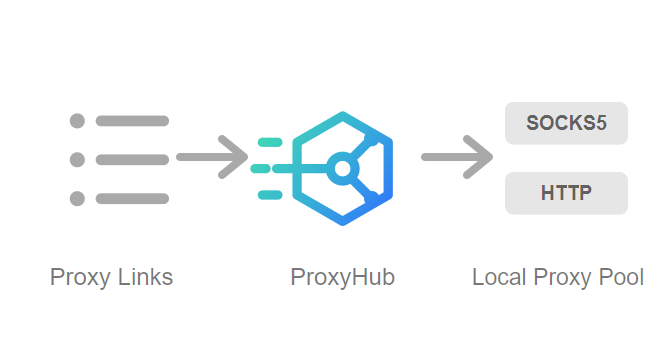
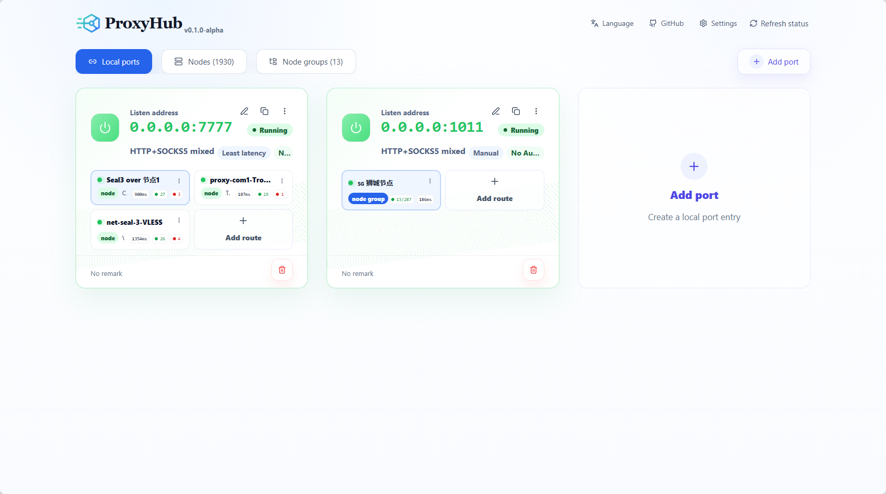
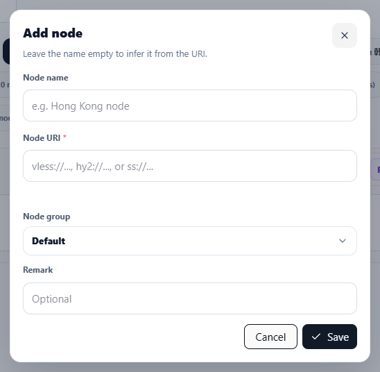
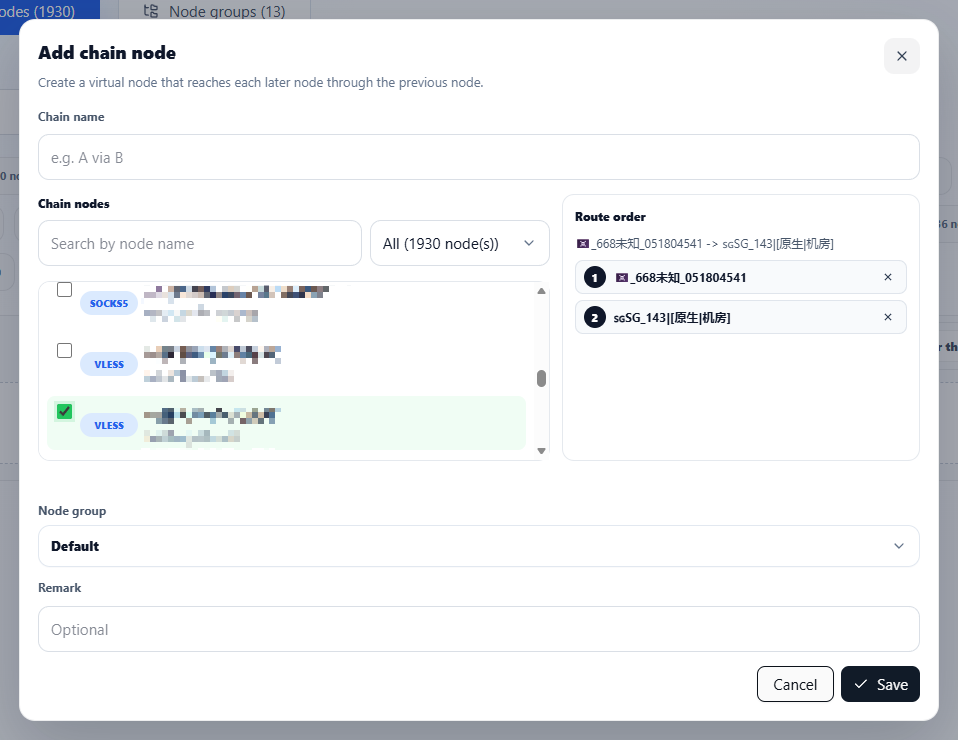
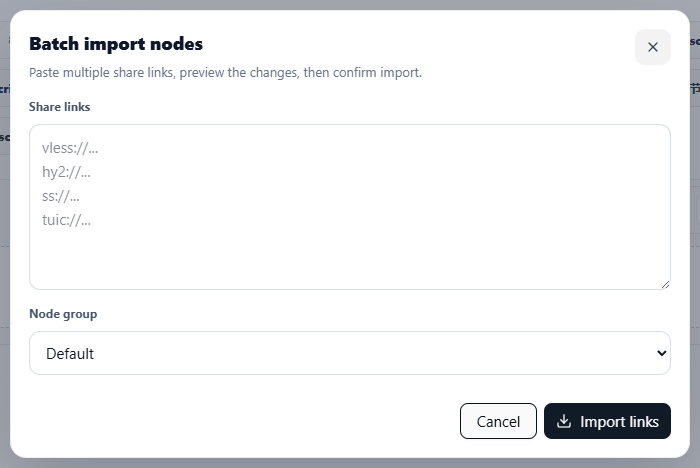

<div align="center">
  

  <h1>ProxyHub</h1>
  <p><strong>Simple proxy format conversion tool</strong></p>
  <p>Import common proxy links and turn them into ready-to-use local SOCKS5/HTTP endpoints.</p>

  <p>
    <a href="README.md">English</a> ·
    <a href="README.zh-CN.md">简体中文</a>
  </p>
</div>

## What It Solves

ProxyHub focuses on everyday proxy link handling: import, preview, convert, probe, and expose stable local SOCKS5/HTTP ports.

## Highlights

| Feature | Why it matters |
| --- | --- |
| Format conversion | Import common proxy links and output local proxy endpoints. |
| Smart routing | Prefer low latency, fail over, balance, or switch manually. |
| Health guard | Probe latency and automatically exclude broken routes. |
| Chain nodes | Build multi-hop paths without hand-editing configs. |
| Bulk import | Paste links or subscriptions, preview, then import. |
| Backup | Move the proxy setup with one JSON file. |

## Screenshots

| Local ports | Add node |
| --- | --- |
|  |  |

| Chain node | Batch import |
| --- | --- |
|  |  |

## Quick Start

### Docker

```bash
docker run -d \
  --name proxyhub \
  -p 3020:3020 \
  -v proxyhub-data:/app/data \
  ghcr.io/fy0/proxy-hub:latest
```

Then open:

```text
http://127.0.0.1:3020
```

### Binary

Download the latest archive from [GitHub Releases](https://github.com/fy0/proxy-hub/releases), extract it, then run `proxy-hub` or `proxy-hub.exe`.

## Configuration

ProxyHub reads runtime settings from `data/config.yaml`.

Common keys:

| Key | Purpose |
| --- | --- |
| `serveAt` | Service listen address, default `:3020`. |
| `dbUrl` | Database DSN, default `./data/data.db`. |
| `logLevel` | Service log level. |
| `registerOpen` | Whether registration is open. |

SQLite, PostgreSQL, and MySQL DSNs are supported.
