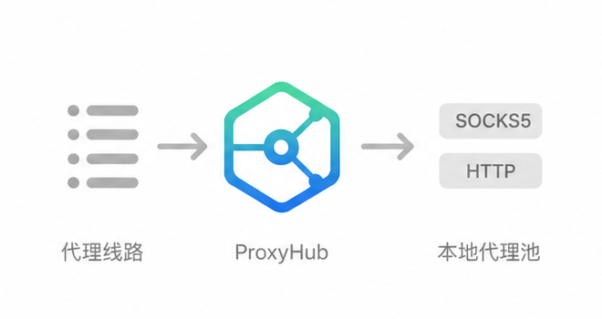
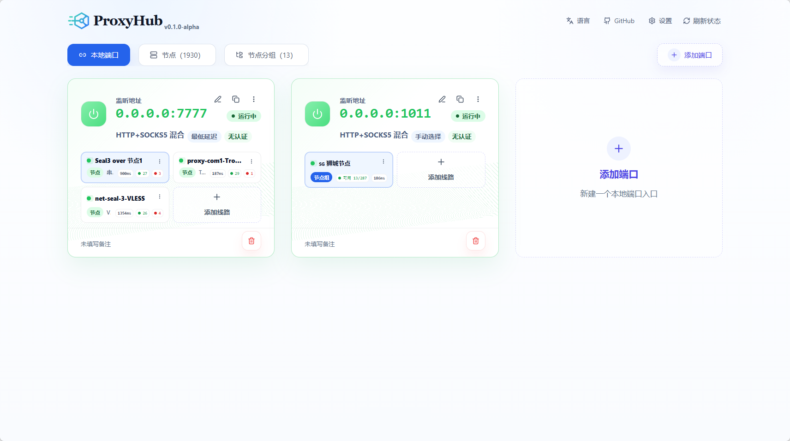
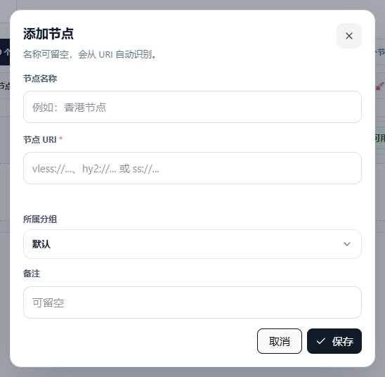
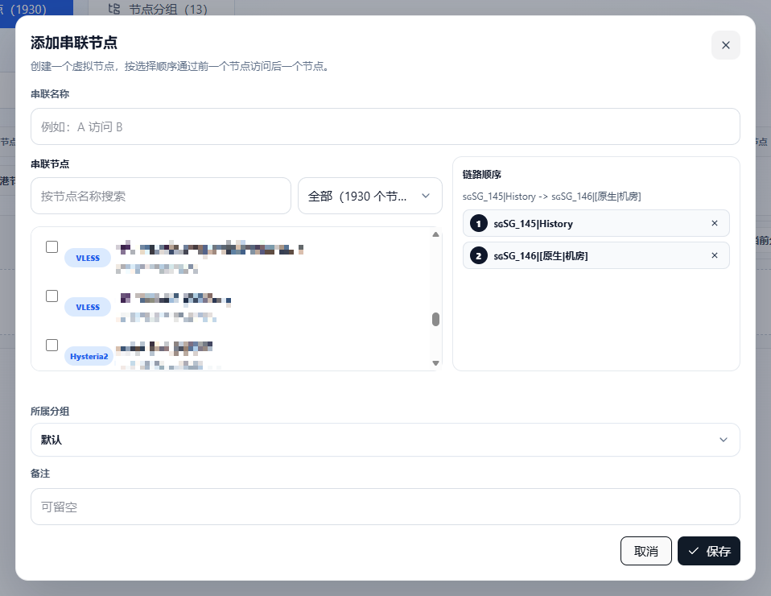

<div align="center">
  <h1>ProxyHub</h1>

  

  <p><strong>简单易用的代理格式转换工具</strong></p>
  <p>导入常见代理链接，快速转换为可用的本地 SOCKS5/HTTP 入口。</p>

  <p>
    <a href="README.md">English</a> ·
    <a href="README.zh-CN.md">简体中文</a>
  </p>
</div>

## 解决什么问题

ProxyHub 面向日常代理链接处理：导入、预览、转换、探测，并输出稳定的本地 SOCKS5/HTTP 端口。可以同时开启多个本地 HTTP/SOCKS 代理。基于 sing-box 开发。

## 特性

| 能力 | 价值 |
| --- | --- |
| 格式转换 | 导入常见代理链接（VLESS、VMess、Trojan、Shadowsocks、Hysteria/Hysteria2、TUIC、SSH、SOCKS5、HTTP），输出本地代理入口。 |
| 智能选路 | 最低延迟、故障转移、负载均衡、手动切换。 |
| 健康守护 | 探测延迟，自动排除坏线路。 |
| 节点串联 | 把多个节点按顺序串成一条代理路径，流量会经过每个节点转发。 |
| 批量导入 | 分享链接或订阅先预览，再导入。 |
| 备份迁移 | 一份 JSON 带走代理配置。 |

## 快速开始

### npm

```bash
npm install -g pxhub
pxhub
```

同时也会安装 `proxy-hub` 命令作为兼容别名。

然后打开：

```text
http://127.0.0.1:3020
```

后续升级到最新稳定版也使用同一个命令：

```bash
npm install -g pxhub@latest
```

### Docker

```bash
docker run -d --name proxyhub -p 3020:3020 -v proxyhub-data:/app/data ghcr.io/fy0/proxy-hub:latest
```

然后打开：

```text
http://127.0.0.1:3020
```

### 二进制

从 [GitHub Releases](https://github.com/fy0/proxy-hub/releases) 下载最新压缩包，解压后运行 `proxy-hub` 或 `proxy-hub.exe`。

## 界面截图

### 本地端口



### 添加节点



### 串联节点



### 批量导入


## 配置

ProxyHub 从当前数据目录读取运行配置：

- npm 全局安装：`~/.proxy-hub/config.yaml`
- 源码/本地二进制直接运行：`./data/config.yaml`

常用配置：

| 配置项 | 用途 |
| --- | --- |
| `serveAt` | 服务监听地址，默认 `:3020`。 |
| `dbUrl` | 数据库 DSN，默认位于当前数据目录下的 `data.db`。 |
| `logLevel` | 服务日志级别。 |

仅支持 SQLite DSN。

## 声明

本项目出于学习目的开发，仅用于作者家里客厅和卧室两台机器的互相访问。因 GPL
协议要求开源。使用者需要自行承担使用后果。

## 许可证

ProxyHub 按 GPL-3.0-or-later 分发，因为发布产物链接了 SagerNet
sing/sing-box。
